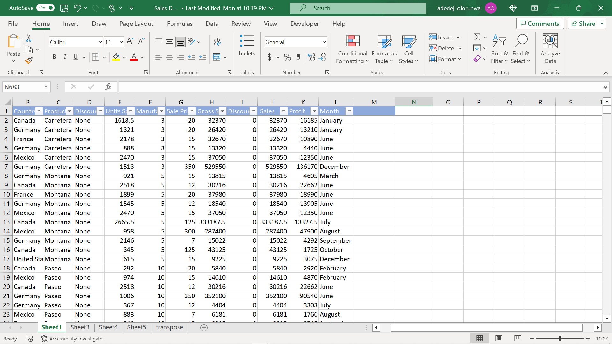
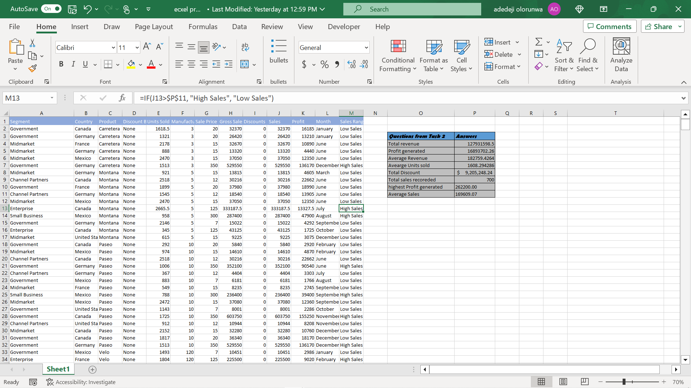
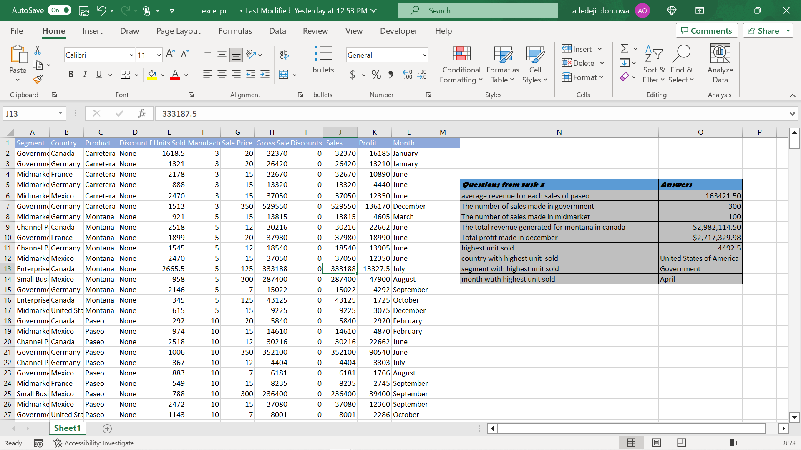

# Analysis-on-sales-records-for-company-A

## Introduction

To derive some informed decision making insight for the **company A**, Statistical analysis was done on the sales record from the mentioned company using Excel

---
### Problem Statement

Using the Sales Data, 
find: 
1.  The total Revenue and Profit generated 
2.  The average Revenue and Units Sold for every order 
3.  The total Discount given in $ 
4.  Total number of sales recorded 
5.  The highest Profit generated 
6.  Create a column named ‘Sales Range’, return ‘High Sales’ if the Sales value is above average, otherwise, return ‘Low Sales’
    
Using the Sales Data,  
Calculate : 
1.  The average revenue generated from each sale of ‘Paseo’ 
2.  The number of sales made in the Government and Midmarket segment 
3.  The total revenue generated from the sales of ‘Montana’ in Canada 
4.  In which Country, Segment and Month was the highest unit of goods sold? 
5.  What is the total profit made in December?
   ---

### skills demonstrated

some of the Excel's functions used are :

- Absolute referencing,
- Sum,
- Xlookup,
- Sumif,
- Sumifs,
- CountIf,
- Maxif,
- Average,
- Averageif.

----

### Data source

  The sales data used was provided by the instructor (sales data )

  

  ---

### Data Transformation, Analysis and visualisation

Task 1 (Analysis + Answers)

---
Task 2 (Analysis + Answers

### Conclusions
- Total revenue =	127931598.5,
- Profit generated =	16893702.26,
- Average Revenue =	182759.4264,
- Avearge Units sold = 1608.294286,
- Total Discount = $9,205,248.24, 
- Total sales recoreded =	700,
- highest Profit generated =	262200.00,
- Average Sales	= 169609.07,
  

- average revenue for each sales of paseo	163421.50,
- The number of sales made in government	300,
- The number of sales made in midmarket	100,
- The total revenue generated for montana in canada	$2,982,114.50,
- Total profit made in december	$2,717,329.98,
- highest unit sold	4492.5,
- country with highest unit  sold	United States of America,
- segment with highest unit sold	Government,
- month wuth highest unit sold	April.

  

